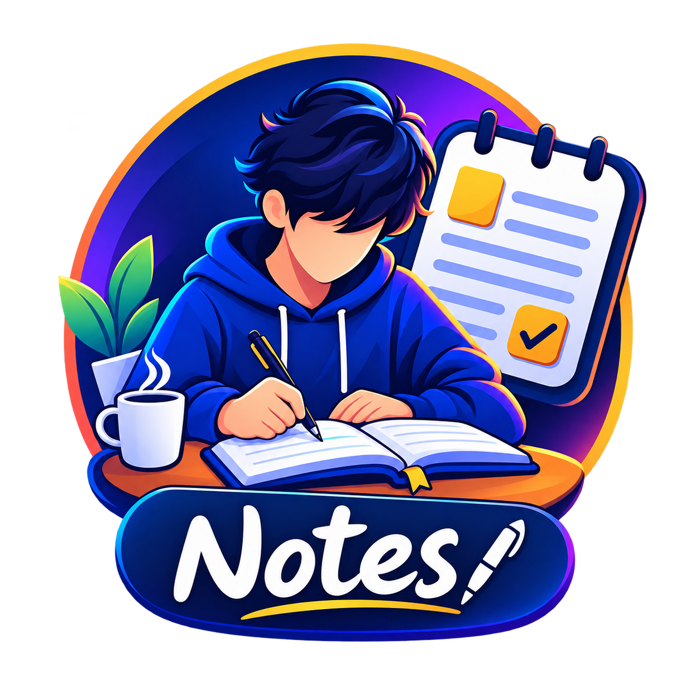

<div align="center">



# 📝 NotesApp (Notes-Desk)

> **A premium, offline-first desktop note-taking studio** engineered for speed, privacy, and seamless multimedia journaling. Built with Electron, React, TypeScript, and local SQLite WebAssembly.

</div>

---

[](LICENSE)
[](https://www.electronjs.org/)
[](https://react.dev/)
[](https://www.typescriptlang.org/)
[](https://tailwindcss.com/)
[-003B57?logo=sqlite&logoColor=white)](https://sql.js.org/)

---

## 🌟 Highlights

- **🔒 100% Offline & Private:** Zero cloud tracking, no mandatory accounts. All data, attachments, and encryption keys stay strictly on your local machine.
- **🛡️ Military-Grade Note Encryption:** Encrypt individual sensitive notes or the entire application with AES-256-GCM and scrypt key derivation.
- **✍️ Modern Block & Markdown Editor:** Powered by TipTap (ProseMirror) with syntax-highlighted code blocks, interactive tables, task checklists, and image embeds.
- **🎨 Built-in Media Studio:**
  - 🖌️ **Canvas Drawing & Sketching:** Handwrite, draw diagrams, and save sketches directly into notes.
  - 🎙️ **Voice Memos:** In-app audio recording with waveform playback.
  - 🖼️ **Image Editor:** Crop, rotate, annotate, and filter attached images without third-party software.
- **🔍 On-Device OCR (Optical Character Recognition):** Powered by Tesseract.js. Extract text from receipts, whiteboards, and screenshots in 12 languages with deep OCR full-text search.
- **📁 Fluid Organization:** Collections/folders with custom icons & colors, multi-tagging, 11 color palettes, pinned/favorite filters, and smart trash recovery.
- **📊 Visual Calendar & Stats Analytics:** Activity heatmaps, checklist completion charts, word/character metrics, and storage breakdown via Recharts.
- **⏰ Smart Reminders:** Native desktop notifications with recurring schedule intervals (daily, weekly, monthly, yearly).
- **🔄 Multi-Format Import & Export:** Export to PDF, Word (DOCX), Markdown (.md), HTML, Plain Text (.txt), and JSON. Import from DOCX, PDF, Markdown, and JSON backups.

---

## 📸 Screenshots & Architecture Tour

```
┌────────────────────────────────────────────────────────────────────────┐
│  NotesApp Desktop                                                      │
├───────────┬────────────────────────────────────────────────────────────┤
│ 📂 Home   │  Good morning, Ganesh                                      │
│ 📝 Notes  │  ━━━━━━━━━━━━━━━━━━━━━━━━━━━━━━━━━━━━━━━━━━━━━━━━━━━━━━━  │
│ 📁 Folders│  [ Collections ]  [ 📌 Pinned ]  [ ⭐ Favorites ]          │
│ 🏷️ Tags   │                                                            │
│ 📅 Cal    │  ┌──────────────┐  ┌──────────────┐  ┌──────────────┐      │
│ 📊 Stats  │  │ Meeting Note │  │ Project Plan │  │ 🎙️ Voice Memo│      │
│ ⚙️ Config │  │ #work #dev   │  │ 75% Tasks    │  │ 02:45 Audio  │      │
│ 🔒 Lock   │  │ 🟢 Work      │  │ 🔵 Personal  │  │ 🟣 Ideas     │      │
│           │  └──────────────┘  └──────────────┘  └──────────────┘      │
└───────────┴────────────────────────────────────────────────────────────┘

```

---

## ✨ Features in Detail

### 1. Rich Text & Markdown Editor
- **Engine:** TipTap v2 on top of ProseMirror.
- **Typography & Formatting:** Headers (H1–H6), bold, italic, underline, strike, text color, highlight, text alignment, blockquotes, and horizontal dividers.
- **Code Blocks:** Syntax highlighting for 100+ programming languages powered by `lowlight` and `highlight.js`.
- **Interactive Tables:** Insert, modify, and delete rows/columns with intuitive controls.
- **Checklists & Progress:** Real-time completion progress tracking with automatic visual indicators.
- **Autosave Engine:** High-performance, debounced autosave down to 0.5s instant typing.

### 2. Creative & Multimedia Tools
- **Handwritten Notes & Canvas:** Embedded canvas modal with pen sizes, colors, eraser, undo/redo, and direct SVG/PNG attachment generation.
- **Audio Voice Notes:** Capture voice thoughts instantly. Stores high-fidelity audio chunks locally with duration metadata and audio player controls.
- **Integrated Photo Suite:** Crop, flip, rotate, and annotate images before embedding them into notes.

### 3. On-Device OCR (Optical Character Recognition)
- Extract text from images without uploading files to third-party APIs.
- Supports **12 offline languages**: English (`eng`), French (`fra`), German (`deu`), Spanish (`spa`), Italian (`ita`), Portuguese (`por`), Russian (`rus`), Hindi (`hin`), Arabic (`ara`), Japanese (`jpn`), Korean (`kor`), and Simplified Chinese (`chi_sim`).
- Full-text search queries match both note text and OCR-extracted text inside images.

### 4. Enterprise Security & Encryption
- **AES-256-GCM** authenticated encryption with random 12-byte IVs and 16-byte authentication tags.
- **Key Derivation:** `scryptSync` with unique cryptographic salts per note to protect against rainbow table attacks.
- **Timing Safe:** Constant-time verification using Node's `timingSafeEqual` to guard against side-channel analysis.
- **App Lock:** Master PIN/password locking when idle or on launch.

### 5. Data Ownership & Portability
- **Export Formats:**
  - 📄 **PDF:** Beautiful document layout generated via `pdfmake`.
  - 📑 **Word (DOCX):** Formatted Microsoft Word exports.
  - 📝 **Markdown & Plain Text:** Clean portable markdown with standard syntax.
  - 🌐 **HTML & JSON:** Full structured dumps.
- **Automated Backups:** Scheduled background backups compressed into timestamped `.zip` archives containing your database and media files.

---

## 🛠️ Technology Stack

| Layer | Technologies |
| :--- | :--- |
| **Desktop Core** | [Electron 33](https://www.electronjs.org/), Node.js 20, TypeScript 5 |
| **Frontend Framework** | [React 18](https://react.dev/), [Vite 5](https://vitejs.dev/), [Electron-Vite](https://electron-vite.org/) |
| **Styling & Motion** | [Tailwind CSS 3](https://tailwindcss.com/), [Framer Motion](https://www.framer.com/motion/), [Lucide React](https://lucide.dev/) |
| **Editor** | [TipTap v2](https://tiptap.dev/), ProseMirror, Highlight.js, Lowlight |
| **Local Database** | [sql.js](https://sql.js.org/) (SQLite compiled to WebAssembly) + JSON / File Storage |
| **Media & Processing**| [Tesseract.js](https://tesseract.projectnaptha.com/) (OCR), [mammoth](https://github.com/mwilliamson/mammoth.js), [pdfmake](https://pdfmake.github.io/docs/) |
| **Charts & Analytics** | [Recharts](https://recharts.org/) |
| **State Management** | [Zustand](https://github.com/pmndrs/zustand) |
| **Packaging** | [electron-builder](https://www.electron.build/) (NSIS Windows Installer, Portable) |

---

## 📁 Project Structure

```text
Notes-Desk/
├── resources/                # App icons (.ico, .png) and Tesseract OCR model assets
├── scripts/                  # Build scripts, smoke tests, and asset copying helpers
│   ├── copy-assets.mjs
│   ├── make-icon.ps1
│   └── smoke-test.mjs
├── src/
│   ├── main/                 # Electron Main Process (Node.js runtime)
│   │   ├── backup.ts         # Automated ZIP backup and restore handlers
│   │   ├── db.ts             # sql.js WebAssembly database initialization
│   │   ├── docx.ts           # Word (.docx) import/export engine
│   │   ├── exportImport.ts   # Multi-format conversion pipeline
│   │   ├── index.ts          # Window management, lifecycle, tray & menus
│   │   ├── ipc.ts            # IPC channels and request dispatchers
│   │   ├── ocr.ts            # Tesseract worker management and language data
│   │   ├── reminders.ts      # Scheduled notifications engine
│   │   ├── repositories.ts   # CRUD operations for notes, tags, collections
│   │   ├── security.ts       # AES-256-GCM encryption & scrypt derivation
│   │   └── storage.ts        # Media attachment storage & filesystem operations
│   ├── preload/              # Secure IPC bridge between Main and Renderer
│   │   ├── index.d.ts        # Typed window.api definitions
│   │   └── index.ts          # contextBridge APIs
│   ├── renderer/             # React Frontend (Vite)
│   │   ├── index.html        # Main HTML entry point
│   │   └── src/
│   │       ├── assets/       # Static assets, branding, and images
│   │       ├── components/   # Modular UI components
│   │       │   ├── collection/# Collection cards, pickers, modals
│   │       │   ├── editor/   # TipTap extensions, Drawing, OCR, Voice, Image modals
│   │       │   ├── layout/   # TopBar, BottomNav, Splash screen, Floating buttons
│   │       │   ├── note/     # Note cards, grid/list/card views, note actions
│   │       │   ├── security/ # App lock and PIN validation screens
│   │       │   └── ui/       # Buttons, modals, dropdowns, toast alerts
│   │       ├── pages/        # Route pages (Home, Notes, Calendar, Stats, Settings, etc.)
│   │       ├── store/        # Zustand state stores
│   │       ├── index.css     # Tailwind CSS configuration and custom themes
│   │       └── main.tsx      # React DOM bootstrap
│   └── shared/               # Shared TypeScript types, schemas, and converters
│       ├── converters.ts     # HTML, Markdown, and plaintext transformation logic
│       └── types.ts          # Shared data contracts (Note, Collection, Settings, etc.)
├── test/                     # Automated unit and database tests
├── electron-builder.yml      # Desktop packaging and NSIS installer configuration
├── electron.vite.config.ts   # Electron-Vite multi-target build configuration
├── package.json              # Dependencies and development scripts
├── tailwind.config.js        # Design tokens, color palette, and theme extensions
└── tsconfig.json             # TypeScript project references configuration
```

---

## 🚀 Getting Started

### Prerequisites

- **Node.js**: `v20.x` or higher recommended
- **npm**: `v9.x` or higher

### Installation

1. **Clone the repository:**
   ```bash
   git clone https://github.com/ganesh7007/Notes-Desk.git
   cd Notes-Desk
   ```

2. **Install dependencies:**
   ```bash
   npm install
   ```

3. **Launch in development mode:**
   ```bash
   npm run dev
   ```

---

## 📜 Available Scripts

| Command | Description |
| :--- | :--- |
| `npm run dev` | Starts Vite dev server with Electron hot reload |
| `npm run build` | Compiles TypeScript and builds production bundles for Main, Preload, and Renderer |
| `npm run preview` | Starts Electron using the built production distribution |
| `npm run typecheck` | Validates TypeScript types across Node and Web targets |
| `npm test` | Runs the test suite using Node's native test runner (`node --test`) |
| `npm run pack` | Bundles the application into an unpacked directory for inspection |
| `npm run dist` | Generates the complete Windows NSIS production installer (`.exe`) in `dist/` |
| `npm run smoke` | Executes automated headless smoke tests to verify app health and DB queries |

---

## ⚙️ Configuration & Customization

The application supports extensive user customization through the **Settings** view:

- **Themes:** Dark, Light, and ultra-black AMOLED mode.
- **Custom Accent Colors:** Real-time accent styling dynamically applied via CSS variables.
- **Layout Densities:** Switch between **Comfortable** and **Compact** information density.
- **Default View:** Toggle between **Grid**, **Card**, or **List** views.
- **Data Retention:** Configure automatic trash purging intervals (e.g. 7, 30, 90 days).
- **Automated Backups:** Set background backup intervals (daily, weekly) with custom destination folders.

---

## ⌨️ Global Keyboard Shortcuts

| Shortcut | Action |
| :--- | :--- |
| `Ctrl + N` | Create a new note instantly |
| `Ctrl + ,` | Open Settings |
| `Ctrl + F` | Jump to search filter |
| `Ctrl + S` | Force save active note (Autosave also runs continuously) |
| `Ctrl + B` / `Ctrl + I` / `Ctrl + U` | Standard text formatting (Bold, Italic, Underline) |
| `Esc` | Close open modals or exit fullscreen editor |

---

## 🤝 Contributing

Contributions, feature requests, and bug reports are welcome!

1. Fork the Project
2. Create your Feature Branch (`git checkout -b feature/AmazingFeature`)
3. Commit your Changes (`git commit -m 'Add some AmazingFeature'`)
4. Push to the Branch (`git push origin feature/AmazingFeature`)
5. Open a Pull Request

---

## 📄 License

Distributed under the **MIT License**. See `LICENSE` for more information.

---

## 👨‍💻 Author

Developed with ❤️ by **[NotesApp / ganesh7007](https://github.com/ganesh7007)**.
